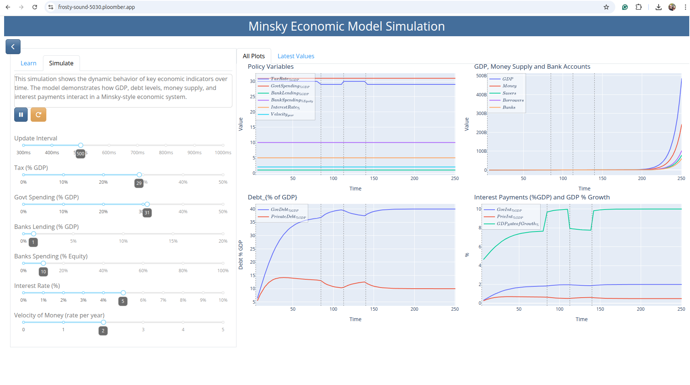

# PlotMinsky

A web application for Minsky modeling using Python and Dash.

( Note: Limitation, it only handles 1 session
To support multiple users without conflicts, we would need to create separate simulation instances per user:)

## Development Setup

### Prerequisites
- Docker installed on your system
- Git (for version control)

### Running in Development Mode

1. Build the Docker image:
```bash
docker build -t plotminsky .
```

2. Run the container with interactive terminal and volume mounting:
 edit the dockerfile ENTRYPOINT for terminal
```ENTRYPOINT ["/bin/bash"]```
```bash
docker run -it --rm -p 8050:8050 -v $(pwd):/app plotminsky
```


This setup:
- Maps port 8050 to your host machine
- Mounts your current directory to `/app` in the container
- Provides an interactive terminal
- Changes to files are reflected in real-time

### Development Workflow
1. Once inside the container, you can run your application:
```bash
python main.py
```

2. The application will be available at `http://localhost:8050`

3. Any changes you make to the files in your local directory will be immediately available in the container


### Run as full docker app
edit the dockerfile ENTRYPOINT for main.py: app 
``` ENTRYPOINT ["uvicorn", "main:app", "--host=0.0.0.0", "--port=80"] ```
```bash
docker run -p 5000:80 plotminsky
```
## Deployment to Ploomber Cloud

### Prerequisites
- Ploomber Cloud account
- Ploomber CLI installed

### Deployment Steps

1. Ensure your `ploomber-cloud.json` is properly configured:
```json
{
    "id": "frosty-sound-5030",
    "type": "docker",
    "ignore": [
        ".git",
        ".gitignore",
        "__pycache__",
        "*.pyc",
        "*.pyo",
        "*.pyd",
        ".Python",
        "env/",
        "venv/",
        ".env",
        ".venv/",
        "*.so",
        "*.zip",
        "app-*.zip",
        "**/*.zip"
    ]
}
```

2. Deploy to Ploomber Cloud:
```bash
ploomber-cloud deploy
```

all going well the app will be viewable at a url like 

```https://frosty-sound-5030.ploomber.app/```


## Screenshots



*The main dashboard showing the Minsky model visualization*

### Debug Console
https://www.platform.ploomber.io/applications


### Important Notes for Deployment
- The Dockerfile is configured to run the application in production mode
- Port 8050 is exposed for the web application
- The application runs as a non-root user for security
- All necessary dependencies are installed during the build process

### Troubleshooting Deployment
- If you encounter issues with zip files being included, check the `.dockerignore` and `ploomber-cloud.json` files
- Ensure all required files are present in your repository
- Check the deployment logs for any specific errors

## Project Structure
- `main.py`: Main application entry point
- `app_dash1.py`: Dash application implementation
- `config.json`: Configuration settings
- `BOMDwithGovernmentLive.mky`: Minsky model file
- `requirements.txt`: Python dependencies
- `Dockerfile`: Container configuration
- `ploomber-cloud.json`: Ploomber Cloud deployment configuration
